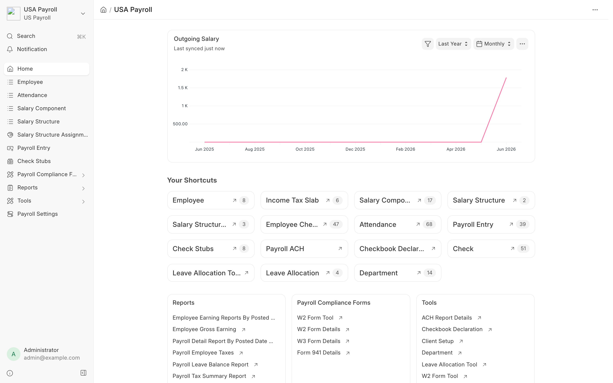
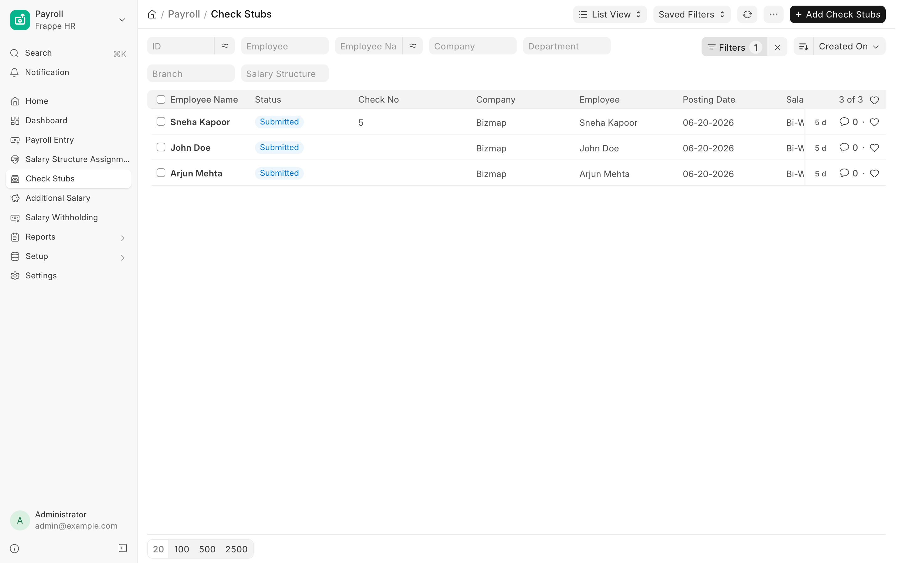
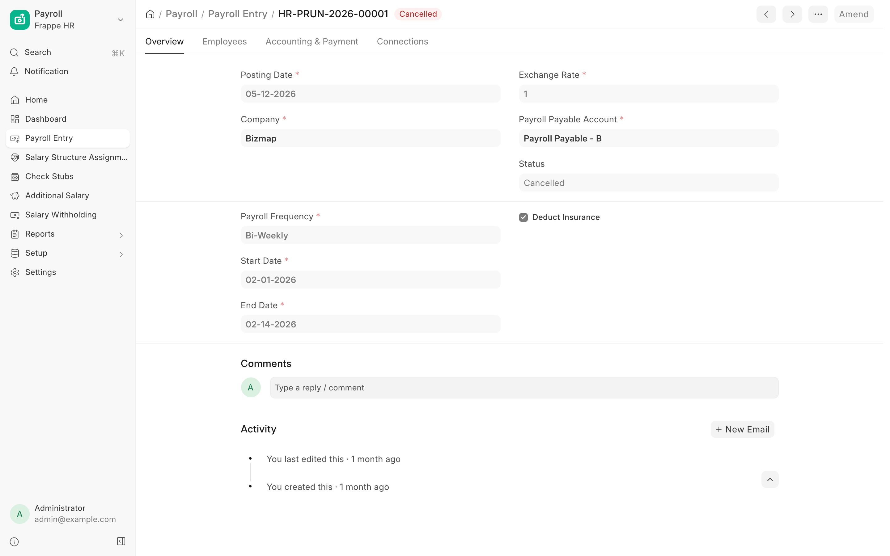
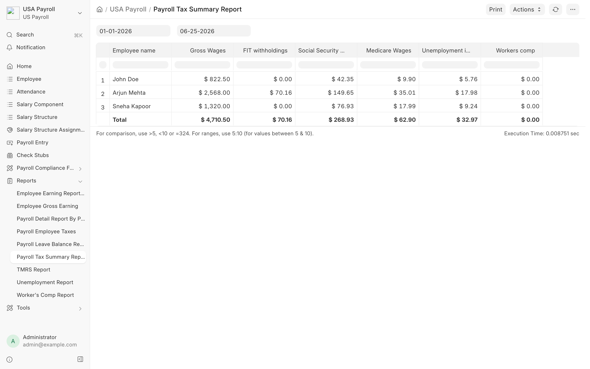
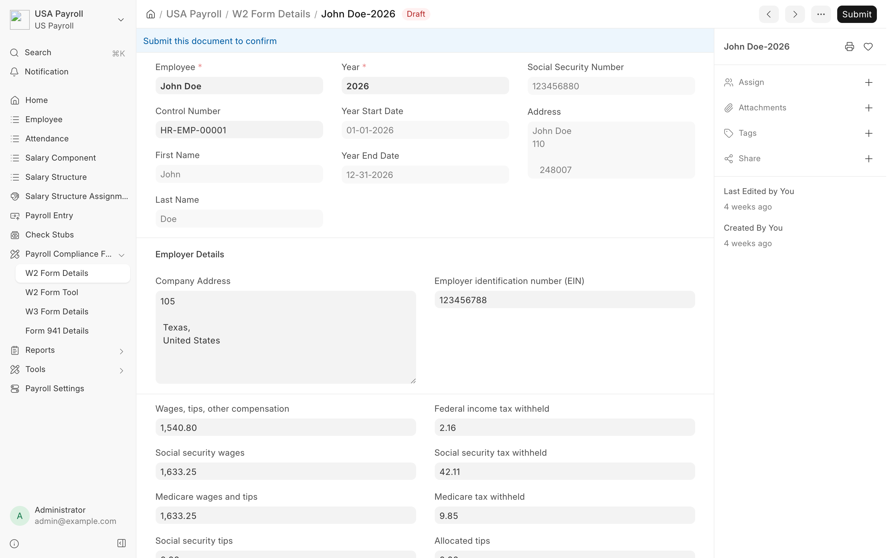
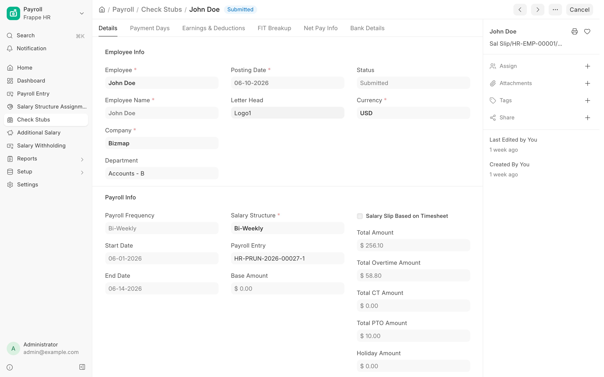

<div align="center">
	
	<h2>US Payroll</h2>
	<p><b>A payroll module for ERPNext, built for US compliance</b></p>


</div>

<div align="center">
	
</div>

<br />

<div align="center">
	<a href="https://bizmap.in/us-payroll-wiki">Documentation</a>
	·
	<a href="https://bizmap759-my.sharepoint.com/:v:/g/personal/ranbir_s_bizmap_in/IQCv261Hi1WuSb8W3HZO-9iyAZOt8L8kjAIlntL0y39si-A?e=LO1VaQ">Video Guide</a>
	·
	<a href="https://bizmap.in">Website</a>
</div>

## US Payroll

US Payroll by **Bizmap Technologies** brings complete, US compliant payroll to Frappe and ERPNext.
Run pay cycles, calculate federal and FICA taxes, pay your team by ACH or printed check, and produce
the statutory tax forms, all from one connected workspace.

It builds on the ERPNext and Frappe HR payroll engine and adds the pieces US employers need: income
tax slabs, FICA handling, ACH direct deposit, printed checks, and the W2, W3 and Form 941 filings.

## Key Features

- **Salary processing**: salary components, salary structures and assignments, payroll entries, and
  check stubs (salary slips) for every pay cycle.
- **US tax handling**: income tax slabs with federal income tax withholding and FICA (Social Security
  and Medicare) built into your salary components.
- **Direct deposit (ACH)**: store company and bank details and generate ACH files ready for your bank.
- **Printed checks**: declare a checkbook, issue checks in bulk, and track check numbers and usage.
- **Statutory tax forms**: generate W2 and W3 forms and the quarterly Form 941, with bulk tools for
  year end filing.
- **People and time**: employees, check ins, attendance, departments, and bulk leave allocation.
- **Reports**: employee earnings, gross pay, payroll detail, employee taxes, leave balances, tax
  summary, TMRS, unemployment, and workers comp.

<details open>
<summary><b>View Screenshots</b></summary>

<br />

**Check Stubs (salary slips)**


**Payroll Entry**


**Payroll Tax Summary Report**


**W2 Form**


**Check Stub detail**


</details>

## Documentation and guides

- **Product wiki:** https://bizmap.in/us-payroll-wiki
- **Video walkthrough:** [watch the guided tour](https://bizmap759-my.sharepoint.com/:v:/g/personal/ranbir_s_bizmap_in/IQCv261Hi1WuSb8W3HZO-9iyAZOt8L8kjAIlntL0y39si-A?e=LO1VaQ)

## Under the hood

- [Frappe Framework](https://github.com/frappe/frappe): the full stack web framework that powers the app.
- [ERPNext](https://github.com/frappe/erpnext) and [Frappe HR](https://github.com/frappe/hrms): the core
  HR and payroll foundation this module extends.

## Compatibility

Pick the branch that matches your Frappe and ERPNext version.

| US Payroll branch | Frappe and ERPNext version |
| --- | --- |
| `version-16` | version-16 (default) |
| `version-15` | version-15 |

## Installation

### Prerequisites

A Frappe site with **ERPNext** and **Frappe HR (hrms)** installed.

### Install on an existing bench

```bash
cd $PATH_TO_YOUR_BENCH

# choose the branch that matches your ERPNext version (version-16 or version-15)
bench get-app https://github.com/Bizmap-Technologies-Pvt-Ltd/US-Payroll.git --branch version-16

bench --site your.site.name install-app us_payroll
```

Open the **USA Payroll** workspace in the desk to start setting up employees, salary structures and
pay runs. The full step by step guide lives in the [product wiki](https://bizmap.in/us-payroll-wiki).

## Development

This app uses `pre-commit` for code formatting and linting (ruff, eslint, prettier, pyupgrade).

```bash
pip install pre-commit
cd apps/us_payroll
pre-commit install
```

## Support

US Payroll is built and maintained by **Bizmap Technologies**. For demos, onboarding or support,
reach us through [bizmap.in](https://bizmap.in).

## License

[MIT](license.txt)
